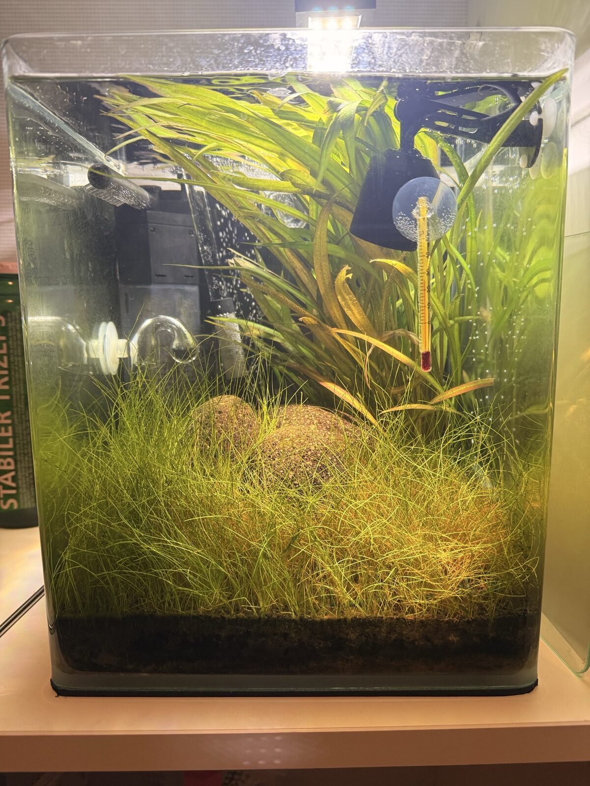
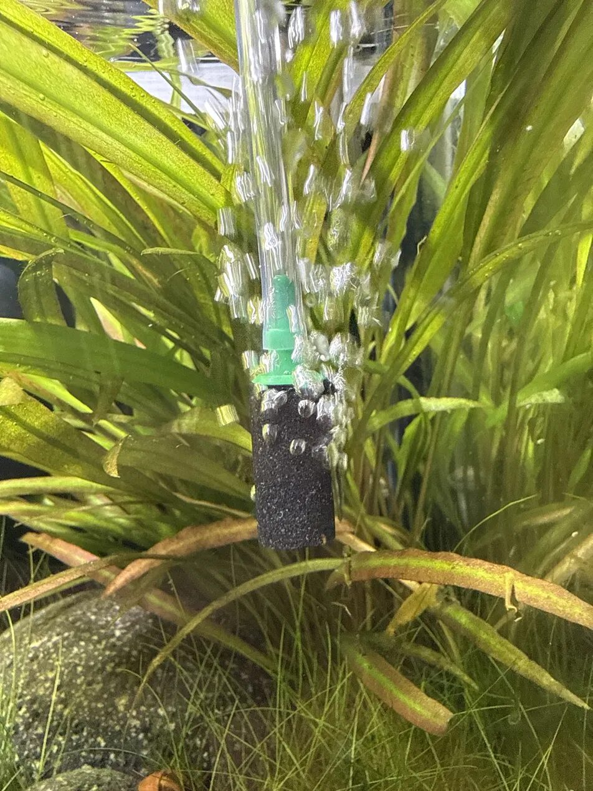
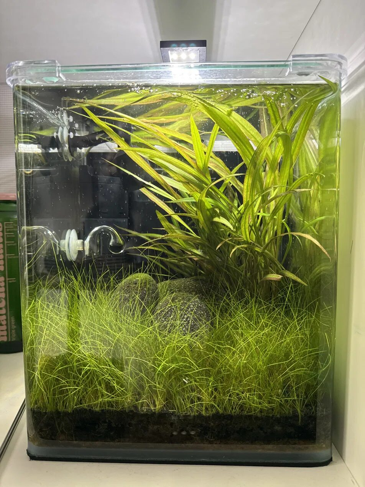

# fishtank

Personal knowledge base for Tom's planted Neocaridina shrimp nano tank
in Amsterdam.

Used by Claude (or any LLM agent) to give grounded, tank-specific advice
and to keep the tank's state up to date over time. Next time you start
a conversation about the tank, the agent has full continuity: hardware,
livestock census, what was ordered, what was decided and *why*, and
what to watch for.

## Highlights

A quick browse through how the tank's been going — newest first. The full
day-by-day story (and the reasoning behind every decision) lives in
[`journal/`](journal/).

### Week of 22 June 2026 — the tank goes digital 📟

Big week for instrumentation. A full **Shelly monitoring kit** went in:
a waterproof probe now tracks **water temperature** continuously, a little
e-ink display reads out **room temp and humidity**, a **leak sensor** sits
under the cabinet to catch a canister drip, and a set of **desk buttons**
toggles the lights without reaching for a phone. With live temperature
logging finally in place, the **in-tank heater came out** — the tank now
runs entirely on the **Oase canister and its built-in heater**, one tidy box
doing both filtration and heating, no equipment left in the water. Right on
cue, a **second heatwave** rolled in on Wednesday (forecast through Sunday):
the tank's sitting at 27.3°C with the desk fan running and the night airstone
doing real work — warm water holds less oxygen, so that's the line to hold.

### Week of 1 June 2026 — brood 2 arrives 🦐🦐

**Brood 2 released on 5 June** — a few days ahead of schedule, hurried
along by the warm spell — and mommy molted right on cue, with a fresh
saddle already showing by the 7th, so brood 3 is brewing for early July.
A brood-1 baby was spotted grazing up in the grass blades (~5mm now,
right on track). The week's one hiccup: the air pump was humming through
the floor to the neighbour below — a folded towel under it fixed that
overnight.

### Week of 25 May 2026 — the canister goes in 🌿

The clog-prone internal filter is being retired for an **Oase canister
filter** with glass lily pipes and a fine stainless-mesh intake guard (too
tight for a baby shrimp) — both run in parallel for a few weeks while the
new media cycles. **Brood 1** is now 4+ shrimplets grazing on the grass
tips and visibly bigger. Two mysteries also got settled: the tiny
glass-clear critters are harmless **ostracods**, and the nerites' "blue
dots" turned out to be **shell erosion** from soft aquasoil water. Then an
early Amsterdam heatwave (28°C) rolled in — a desk fan and the night
airstone are holding the line.



### Week of 18 May 2026 — a near-miss and a big decision

The eventful one. A **pre-dawn oxygen dip** left both adults gasping at the
surface one morning — caught in time, fixed by breaking the surface and
pulling the lid, and it prompted adding a **night air pump** for
independent insurance. The repeatedly-clogging internal filter pushed the
decision to **upgrade to a canister**. And the payoff: the **first baby
shrimp** was spotted out grazing, confirming brood 1 had survived.



### Week of 11 May 2026 — first babies 🦐

Where the journal starts. **Brood 1 released** — around 20 fully-formed
miniature shrimplets hiding in the hairgrass — and mum was re-berried with
brood 2 within a day. Here's the tank at its baseline: Dennerle Nano Cube
20, hairgrass carpet, sword plant, lava rock and aquasoil.



## Structure

```
fishtank/
├── CLAUDE.md           # loads AGENTS.md into Claude Code at startup
├── AGENTS.md           # instructions for any agent working here
├── .claude/commands/   # slash commands: /log /status /week /groom
├── memory/             # current state — overwriting edits
│   ├── tank.md         # hardware, equipment, layout
│   ├── livestock.md    # current census, breeding
│   ├── parameters.md   # target ranges + latest reading
│   ├── pending.md      # orders in flight, install plans, todos
│   └── knowledge.md    # settled care decisions and why
├── data/
│   └── measurements.csv  # append-only measurement log
└── journal/            # append-only history with photos
    ├── README.md       # convention for entries + photos
    └── YYYY-Www/       # ISO week folders
        ├── YYYY-MM-DD.md
        └── YYYY-MM-DD-slug.jpg
```

Two-tier model: `memory/` is *what's true now* (snapshot), `journal/` is
*what happened, when* (event log + photos). The journal is the source of
truth for history; the snapshot is a projection.

## How to use

Open Claude Code in this directory. `CLAUDE.md` pulls `AGENTS.md` into
context at startup; the agent then reads `memory/` and the latest
journal week before giving advice. Just say what happened:

- "Brood 2 hatched today" → journal entry + `livestock.md` update
- "TDS reading 180" → journal entry + `data/measurements.csv` row
- "Filter arrived" → journal entry + `pending.md` item resolved + start install
- "Saw both adults at the surface this morning" → journal entry + maybe
  a `knowledge.md` update if the diagnosis changes

Or use the slash commands for the stereotyped flows:

- `/log <what happened>` — journal entry + memory updates + commit
- `/status` — tank state summary
- `/week` — wrap the week into a Highlights entry above
- `/groom` — consistency sweep (drift, stale items, oversized photos)

Photos: drop them into the conversation, the agent compresses and saves
them into the appropriate week folder alongside a note.
