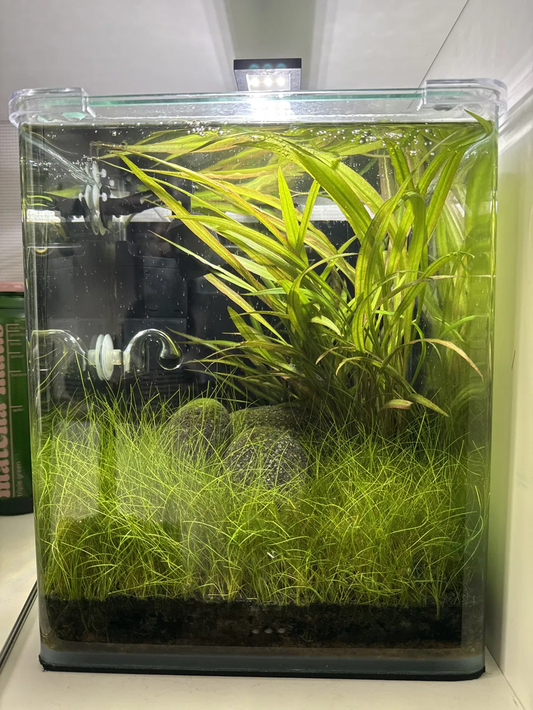

# 2026-05-17

## Brood 1 just released
Mommy birthed yesterday (~2026-05-16). ~20+ tiny shrimplets, fully-formed
miniatures hiding in the hairgrass.

→ updated `memory/livestock.md` (brood 1 recorded)

## Filter-off mistake, corrected
Briefly turned the Dennerle filter off worried about intake sucking up
shrimplets. Bad call — filter off >few hours kills nitrifying bacteria
(aerobic, suffocate without flow) → way bigger risk than the intake.
Filter back on within an hour. Need to sponge the intake instead, not
remove flow.

→ added to `memory/knowledge.md` (Filter maintenance section)

## Mommy berried again
Saddle is yellow and progressing — she's carrying clutch 2 already, less
than 24h after releasing clutch 1. Normal Neocaridina biology: molts
~24-48h after release, mates immediately post-molt. Brood 2 due
~mid-June (25-30 day carry).

→ updated `memory/livestock.md` (brood 2 in progress)

## Tank overview photo

Dennerle Nano Cube 20, ~17L water after substrate. Hairgrass carpet,
sword plant, lava rocks, aquasoil. Chihiros CO2 with glass diffuser.
Dennerle internal filter on back-left. In-tank heater visible too.
Established ~6 months.

## Decisions
- Keep CO2 timing as-is (off ~1h before lights-off — correct).
- Don't worry about feeding shrimplets specifically; biofilm + mature
  tank provides everything.
- Cover the filter intake instead of restricting flow.
