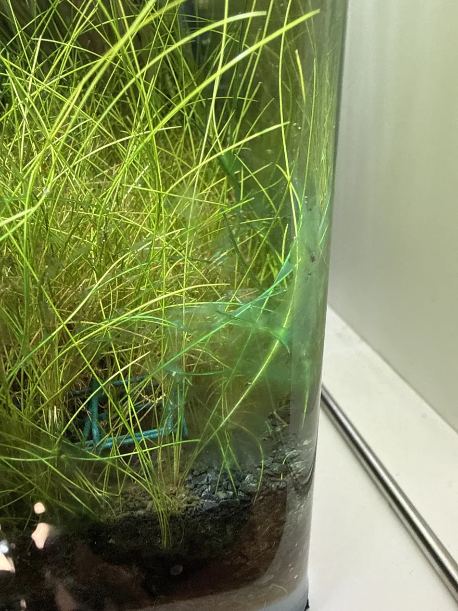

# 2026-05-22

> **Correction (2026-05-24)**: I called the dead corner "back-right"
> throughout this entry. It's actually **front-right**. Body text
> below preserved as historical record; the corrected geometry lives
> in `memory/tank.md`.

Eventful day. Three things, in order they happened.

## Dawn O2 near-miss (morning)

Both adults found hanging at the surface pre-dawn, before lights-on.
Classic O2 dip signature: shrimp trying to reach the air-water interface
where O2 is highest. Stack of contributing factors:

- Dennerle filter slightly sluggish (clogging up again)
- Lid was on overnight
- Dense plants respiring all night (no photosynthesis without light)
- CO2 had been on yesterday (residual not the cause, but no margin)

Fix (immediate, within minutes):
1. Tilted filter outflow up to break surface — visible ripple/splashing
2. Removed lid entirely
3. Skipped CO2 for the next 24h as a reset

Outcome: both adults descended and resumed normal grazing within the hour.
**Caught it in time.** Could easily have gone the other way if I'd slept
in.

→ added to `memory/knowledge.md` (CO2 and oxygen — the big one)
→ informs Aeration decision later same day

## Detritus webs in back-right corner (midday)

Fine wispy stuff draped over hairgrass in the back-right corner. Looks
spider-web-like. Breaks into dust easily when disturbed. Keeps
reappearing in the same spot after spot-cleaning.

Initially worried it was cyanobacteria (BGA) — but the smell test
disconfirmed: pulled some out and sniffed, smelled neutral / earthy /
sand-bark, not the musty swampy smell that BGA always has.

Real diagnosis: **detritus + bacterial biofilm webs** accumulating in a
dead-flow zone. Not algae. Not dangerous. Just stagnant water + settling
particles + bacterial growth binding it together.

Why this spot specifically: filter is back-left, outflow circulates
water clockwise, back-right is where flow loses momentum. Hairgrass
acts as a baffle trapping drifting particles. Classic "death corner."

Permanent fix: position the new canister's **inflow** in this exact
corner — actively pulls accumulated detritus into the filter where it
belongs.

→ updated `memory/tank.md` (Layout / flow geometry — death corner)
→ added to `memory/knowledge.md` (smell-test diagnostic)

## First baby shrimp spotted! (afternoon)

Out grazing in the hairgrass, scraping biofilm with tiny claws. The
first confirmed sighting since brood 1 was released ~6 days ago.

This is the milestone signal — means at least some shrimplets are
alive, growing, and confident enough to leave the carpet base. Where
there's one visible, many more are nearby.

→ updated `memory/livestock.md` (brood 1, first sighting date)

## Aeration decision: bought air pump (afternoon)

After this morning's near-miss, decided the lid-off + tilted-outflow
plan isn't enough on its own. Bought from Pets Place same day:

- **Tetra AirSilent Mini** air pump (~50 L/h, designed for nano tanks)
- **Tetra AS25** airstone (cheapest sintered option in stock)
- Check valve

Reasoning recorded in detail in `memory/knowledge.md` (Aeration decision
section). Short version: I watch the tank ~8h/day from my desk but I'm
not watching at 4am, which is exactly when O2 dips happen. €25 + 5 min
buys independent redundancy.

Installed in back-right corner alongside CO2 diffuser. Smart-plug
scheduled inverse to CO2 — night only.

→ updated `memory/tank.md` (Aeration section)
