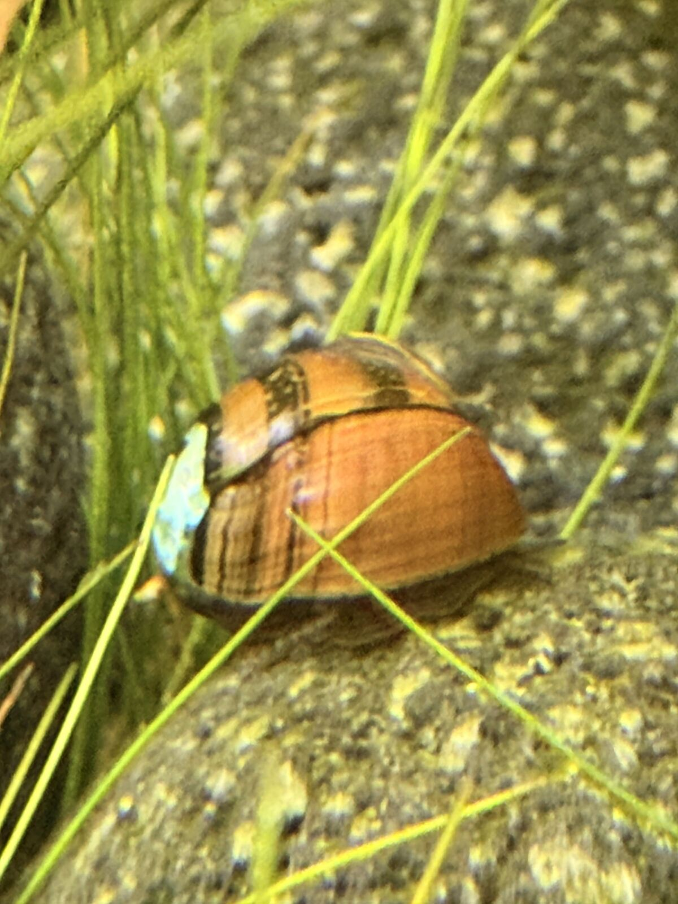

# 2026-05-25 — snail ID + shell erosion

Tom sent a photo of one of the snails (he'd previously described them
as "blue dots on the shells, species not recalled").

## ID

**Tiger Nerite** (*Vittina semiconica*). Diagnostic features visible:
- Globular reddish-amber shell
- Darker spiral bands following the shell's growth pattern
- No horns, no spots, no zebra stripes — rules out the previous
  candidates (Horned, Spotted, Zebra Nerite)

Updated `memory/livestock.md` from "candidates" to confirmed ID.

## The "blue dot" is shell erosion

The turquoise patch Tom thought was a natural marking is **nacre layer
showing through eroded outer shell**. Diagnostic:
- Irregular shape (a marking would be more uniform)
- Slightly recessed/textured edges
- The turquoise iridescence is characteristic of mother-of-pearl

Both snails reportedly have similar "blue dots" in similar spots →
strongly suggests environmental cause, not coincidence.

### Cause

ADA Amazonia substrate pulls KH and pH down → soft, slightly acidic
water dissolves calcium carbonate shells over time. Nerites are
brackish-origin and especially sensitive. This is the single most
common nerite problem in long-running aquasoil tanks without
remineralisation.

### Fix (post-trip)

1. **Salty Shrimp GH/KH+** — already on shopping list, priority bumped.
   Lifts KH in top-off water, stops further dissolution.
2. **Cuttlebone** — small piece tucked in filter or behind rock.
   Dissolves slowly, buffers calcium. ~€2 from pet/bird shop.

Erosion won't regrow but can be halted. Slow burn (months/years to
shell failure), not urgent for the trip.

→ updated `memory/livestock.md` (Snails section: confirmed ID,
   erosion subsection)
→ updated `memory/pending.md` (Salty Shrimp priority bumped,
   cuttlebone added)

## Caveat

Only one snail photographed, one side visible. Second snail not yet
confirmed. Worth a side-on shot of snail #2 next time it's in a good
spot, but the prior is high that it has the same erosion pattern.
