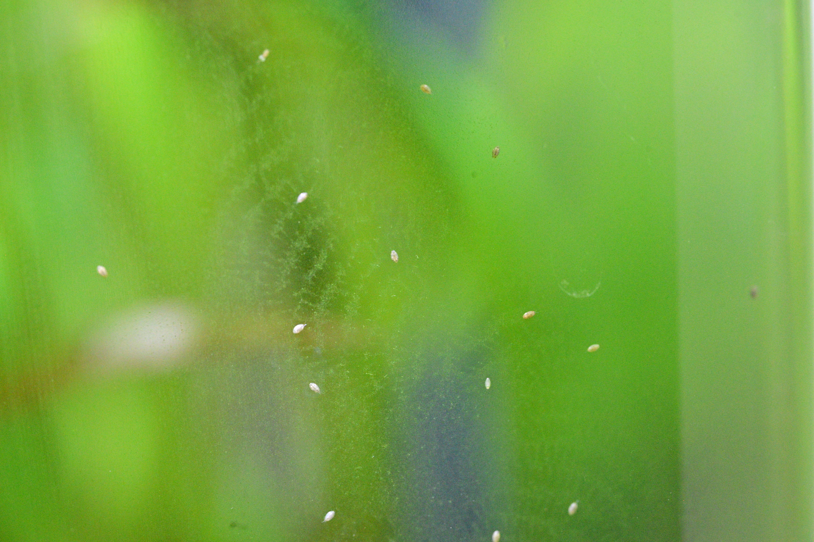

# 2026-05-25

## Mystery critters ID'd: ostracods

Tom asked about tiny "stick insect looking" glass-clear critters all
over the tank — Michelle's brother had said they're a sign of a
healthy tank.

Photo settles it: **ostracods** (Ostracoda, "seed shrimp"). Not
stick-like on closer look — they're 1-2mm oval/sesame-seed shapes
with a hinged bivalve-like carapace, crawling on the glass. Cream
to whitish.

- Harmless detritivores — eat biofilm, decaying organics, leftover food
- Free shrimplet snack
- Reproduce by parthenogenesis → population booms with surplus food →
  useful overfeeding indicator
- Their presence = mature, stable biofilm. Brother-in-law was right.

Not hydra, not planaria, not damselfly nymphs. Nothing that touches
shrimplets. Stand down.

→ added Microfauna section to `memory/livestock.md`

## Trip planning (28 May → 8 June, 10 days)

Tom is away for 10 days. Michelle (also a shrimp keeper, own ~25-30L
nano CO2 tank) is covering. Discussed whether to do a water change
before leaving.

**Decision: skip the water change.** Reasoning:
- Still inside the 2-3 week no-big-changes window after brood 1 release
  (~2026-05-16, ~9 days ago)
- Tank is mature and wildly under-stocked → 10 days of drift in this
  load is negligible
- A change today with no monitoring afterward is *worse* than no
  change — any subtle TDS/temp mismatch goes unnoticed
- Tom's own knowledge.md: *"stability > freshness"*

**Pre-trip checklist instead:**
1. Squeeze out Dennerle sponge in tank water (it was sluggish on
   2026-05-22, don't want it clogged solid by day 6)
2. Run airstone 24/7 during the trip, not just inverse-to-CO2
   (knowledge.md: *"Tom going away >1 day → airstone becomes
   load-bearing"*)
3. Top up evaporation immediately before departure
4. Brief Michelle on logistics only: feeding cadence (pinch every 3-4
   days max), top up with dechlorinated tap if water drops >1cm, don't
   touch the carpet. No symptom-spotting briefing needed — she knows.

**Heads-up for Michelle:** Brood 2 release window is 2026-06-11 to
2026-06-16 — likely during the trip. Mommy may suddenly look slimmer
and tiny things may appear in the hairgrass. No action needed; she'll
recognise the signs.
