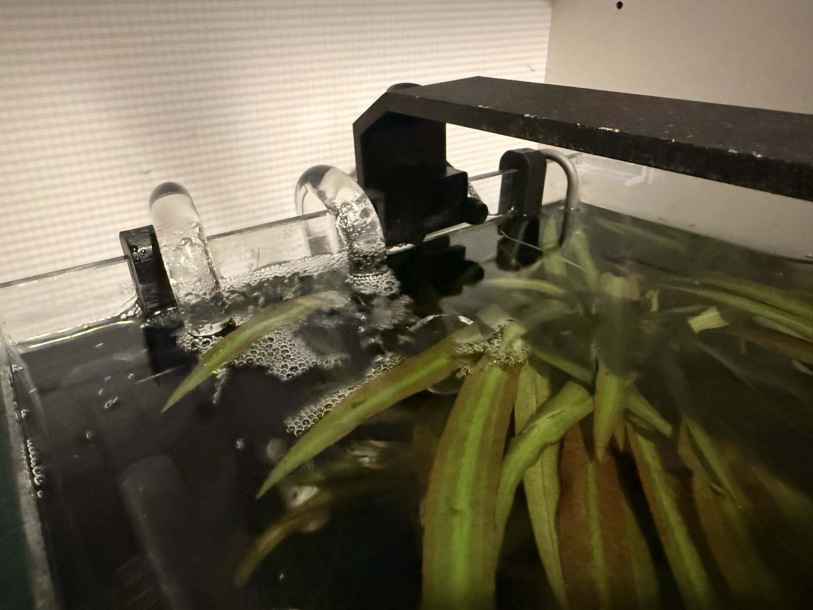
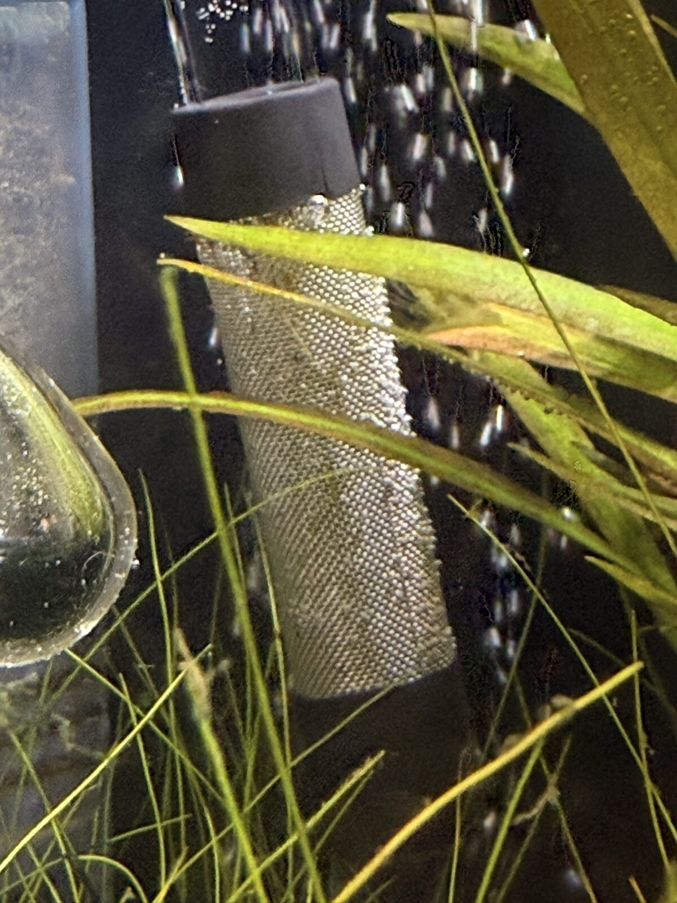

# 2026-05-26

## Canister filter installed and running

Oase FiltoSmart Thermo 100 is in and running well as of today. Running
side-by-side the Dennerle internal filter for the parallel-cycle period.

Setup as actually done (deviations from the `pending.md` plan noted):

- **Media**: ceramic tubes loaded, rinsed first.
- **No Dennerle seed sponge transferred.** Plan was to cut 1/3-1/2 of the
  Dennerle sponge into the canister's coarse layer; Tom left the Dennerle
  intact instead. Defensible — it clogs fast under load and he didn't want
  to weaken a working filter with babies present. **Consequence**: the new
  ceramic media is colonising from scratch off the tank's own bacterial
  reservoir (mature Amazonia substrate + shared water), not a direct seed.
  So the 3-week parallel run is now a *minimum target, not a guarantee* —
  **Dennerle removal is gated on a zero-ammonia test, not the calendar.**
- **Glass lily pipes fitted directly** — skipped the plan's plastic-first
  leak-test de-risking step. Both inflow + outflow at the back wall,
  roughly centred. Temporary; reposition after Dennerle removal.
- **Intake guard**: stainless mesh first looked too short to cover all the
  inflow holes. Resolved by sliding it further up — now fully covers. (Tom
  rejected the electrical-tape idea from earlier; correct call — adhesive
  + plasticisers leach in a nano shrimp tank.) Hard-floor baby-suction item
  closed. Photo-confirmed 2026-05-26 (fine stainless weave; one open
  question — that the sleeve's bottom end is closed, hairgrass hid it).
- **First run**: big initial blowout of fine dust from the new ceramic
  media — inert mineral fines, harmless — cleared quickly. No apparent harm.

## Confirmed same day

- **Flow throttled** — flow-control valves on both lines, dialed to a
  gentle surface ripple. Correct for a CO2 tank (gentle = no daytime
  off-gassing). **Re-check after Dennerle removal** — losing that filter's
  flow may need the outflow tap opened a touch to hold the same surface
  movement.
- **Outflow breaks the surface** — gentle ripple confirmed. The test is
  whole-surface motion, not amplitude; pre-dawn O2 is covered by the
  night-only airstone regardless. Surface scum would be the signal to
  increase.
- **Dennerle outflow** repointed at the left-side glass to diffuse its jet
  while both filters run (moot once it's removed).

## Still open

- **Brood 2 / Dennerle-removal overlap** — brood 2 release expected
  ~2026-06-11 to 06-16, right on the 3-week mark. Don't stack a filter
  removal on a fresh brood release; if they coincide, wait an extra week.

## Brood 1: 4+ babies, visibly bigger

At least 4 shrimplets grazing on the *ends* of the hairgrass (not just the
base), visibly bigger than a few days ago. Progression: 05-22 = 1,
05-24 = 3, 05-26 = 4+. ~10 days post-release, tracking the expected
week 2-3 curve toward reliable open grazing. Healthy.

→ updated `memory/livestock.md` (brood 1 visible-count progression)

## Heat: 27°C ambient — summer O2 threshold tripped early

Ambient hit 28.1°C / 37% RH today (digital monitor) and may stay high for
~a week — uncommon for Amsterdam but real. The `knowledge.md` summer-heat
threshold (expected ~August) has fired in May. A ~17L tank tracks toward
ambient over a sustained spell, so this is manage-actively, not
ride-it-out. Tank thermometer (uncalibrated mercury) reads ~26°C; Tom
suspects it reads high (real maybe ~24-25) — used for constancy, not
absolute value.

- **Heater test confounded on a hot day.** A heater only adds heat below
  its setpoint; if the room holds the tank at/above setpoint, it never
  fires — so "steady for 2h" proves the room is stable, not the heater.
  Real verification needs a cool night/morning in the next couple of days
  where the thermo has to hold the floor. Tom leaving it a couple days is
  right — just catch a cool spell, then pull the in-tank heater.
- **Warm water = less O2**, stacking with babies + daytime CO2 + dense
  plants. Mitigations in place: night airstone, whole-tank surface ripple,
  dual-filter circulation, lid off, ~8h/day watching. If tank crosses
  ~26°C: clip a fan across the surface (evaporative, ~1-2°C, shrimp-safe).
  Don't ice-bottle — stability beats absolute number. Watch for
  surface-hanging pre-dawn.

- **Action plan** — surface fan (primary cooling; 37% RH makes evaporative
  cooling very effective), top up more often, night airstone now
  load-bearing, unplug the in-tank heater + set the canister thermo to
  **23°C** (normal setpoint for the unattended trip, not 'min' — see Trip
  note below), kill the accent light, heater verification paused until the
  heat breaks.
- **Deployed same day** — desk fan set up blowing toward/over the tank;
  curtains closed (window open for venting); airstone confirmed running
  inverse to CO2 (night = covered). Fan aim still to optimise: rake the air
  *across* the open surface, not at the glass, for max evaporative cooling.

→ logged ~26°C (uncalibrated, constancy-only) to `memory/parameters.md`,
   with an ice-water calibration note
→ added a reusable heatwave protocol to `memory/knowledge.md`
→ added a heatwave watch to `memory/pending.md`

## Trip intersection — away 28 May to 8 June

Reminder from 2026-05-25: Tom's away 10 days (28 May–8 June), Michelle
covering — and it starts mid-heatwave. Adjusts the heat plan for an
unattended tank:

- **Canister thermo set to 23°C** (not the heatwave 'min') so it can hold a
  temperature floor if the weather flips cold while Tom's away. Won't fire
  while it's hot. (Tom set this 2026-05-26.)
- **Airstone stays night-only (inverse to CO2)** — Tom's call (2026-05-26),
  overriding the 05-25 "24/7 for the trip" plan. Reasoning: the schedule's
  worked for months, the night airstone already covers the demonstrated
  pre-dawn risk window, daytime O2 comes from plant photosynthesis + the
  canister ripple, and changing a stable schedule right before an
  unmonitored stretch adds risk. Accepted residual: a daytime canister
  stall while away, unnoticed (low probability). Don't re-suggest 24/7.
- **Fan needs babysitting** — it accelerates evaporation, so Michelle tops
  up more often than the usual >1cm rule. Briefed on fan + top-ups, not
  just feeding.

→ Michelle checklist drafted (WhatsApp); pre-trip plan in
   `journal/2026-W22/2026-05-25.md`

→ updated `memory/tank.md` (filter sections: canister installed + running,
   config as built; Dennerle now in parallel-run phase)
→ updated `memory/pending.md` (delivery checkboxes ticked; install-sequence
   reorganised into done/remaining; ammonia kit bumped to mandatory)
